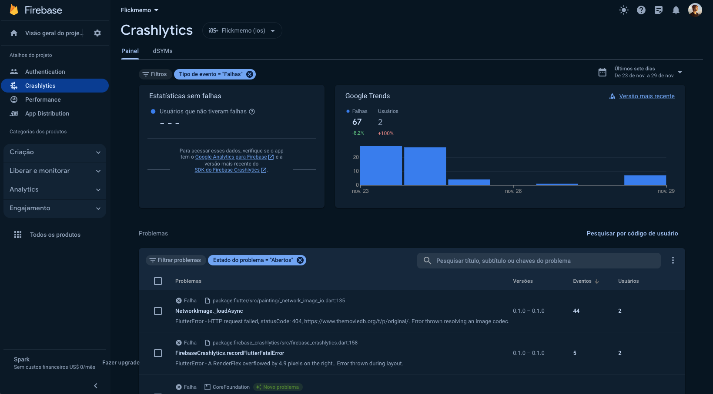
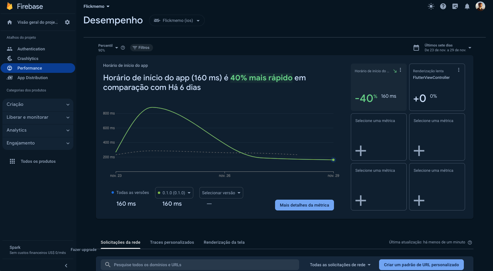

# Monitoring

For Flickmemo's events and bugs monitoring it's being used Firebase with the Crashlytics and Performance modules.

### Crashlytics

Firebase offers for free the Crashlytics for error checks and an issues panel.

  

### Performance

Firebase also offers for free the Performance panel to check the behavior of most of the users.

  

